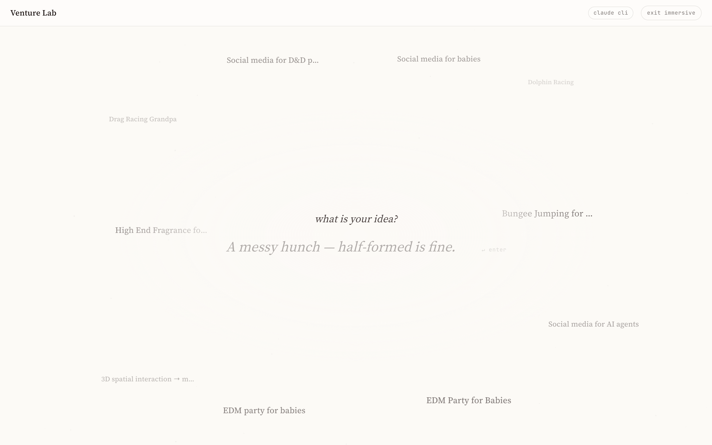
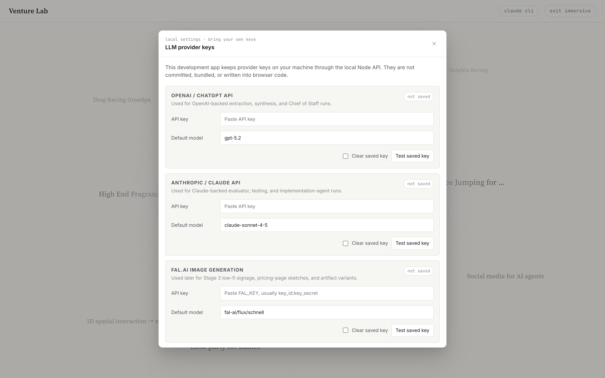
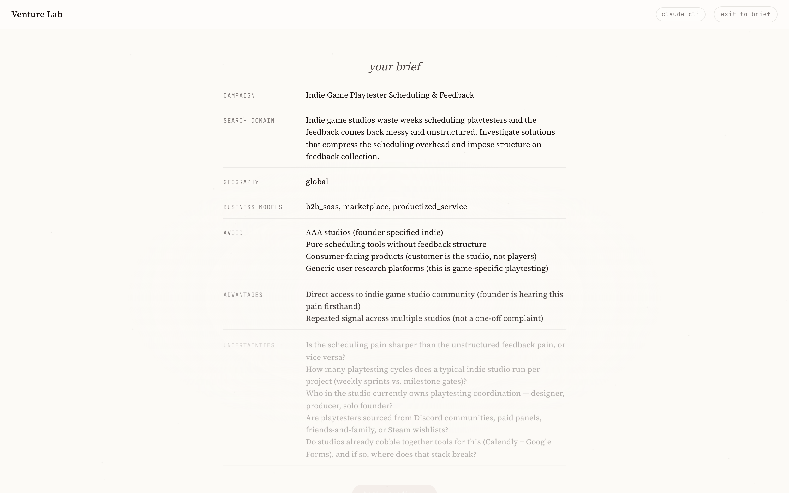
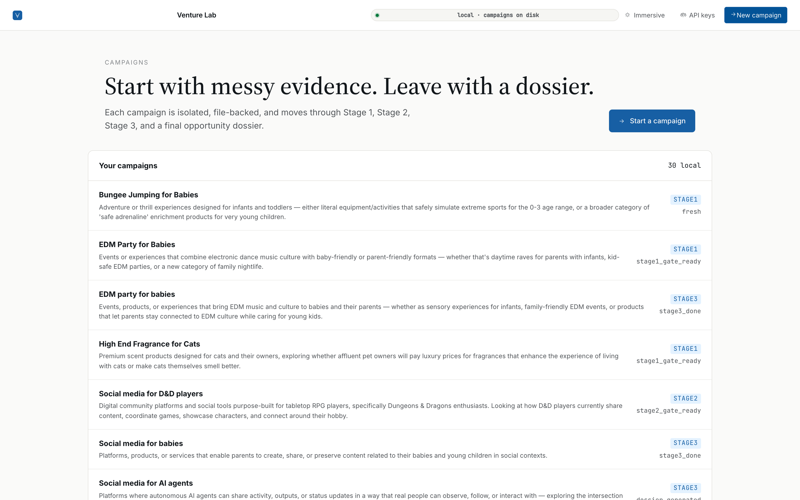
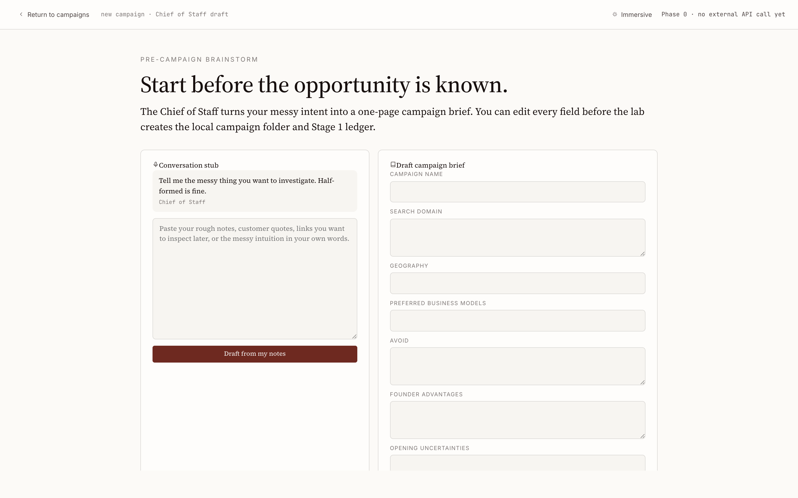
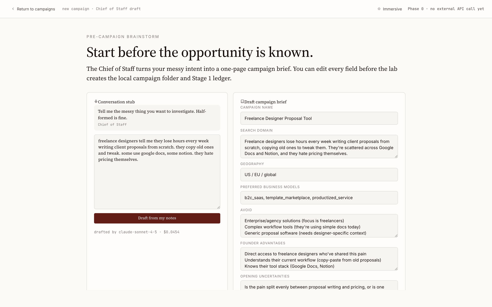
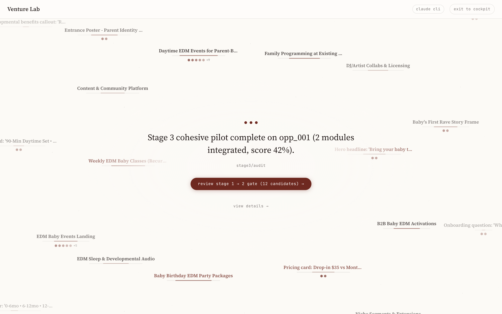
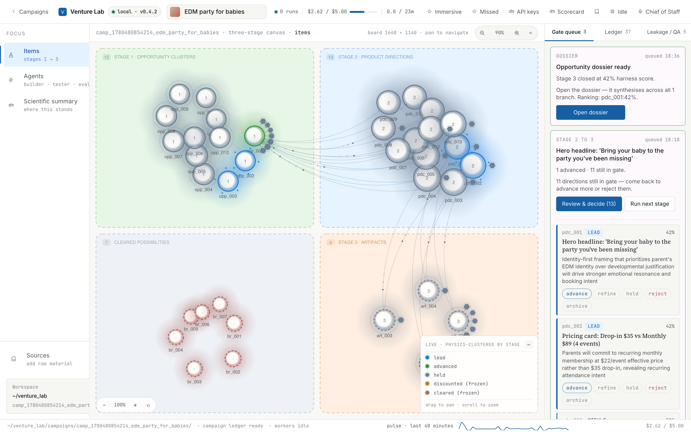

# AI Venture Lab

Local-first opportunity harness. You drop in messy founder material — interview notes, voice memos, forum scrapes, support tickets — and Claude-backed agent teams (Builder / Tester / Evaluator) run a three-stage pipeline that produces evidence cards, opportunity clusters, microtested product directions, simulated-pilot artifacts, and a final editorial dossier.

Everything is real. There is no mock-data path: every cluster, every defense entry, every persona response comes from a Claude call against your campaign's actual sources. Your sources never leave the device.

The app has **two surfaces** you can switch between at any time:

- **Immersive mode** (the default) — a calm, single-prompt editorial surface. Type your idea, watch the brief draft, then watch items orbit a live ledger as the harness runs.
- **Cockpit mode** (normal) — a dense, Linear-style operator console: a three-stage canvas, a live gate/ledger rail, a real cost ticker, and a real pause.

---

## Contents

1. [Prerequisites](#1-prerequisites)
2. [Install](#2-install)
3. [Run the app](#3-run-the-app)
4. [Onboarding — Claude CLI **or** API key](#4-onboarding--claude-cli-or-api-key)
5. [Create your first project](#5-create-your-first-project)
   - [Path A — Immersive mode](#path-a--immersive-mode)
   - [Path B — Normal / cockpit mode](#path-b--normal--cockpit-mode)
6. [The key screens, side by side](#6-the-key-screens-side-by-side)
7. [Switching between the two modes](#7-switching-between-the-two-modes)
8. [Cost transparency](#8-cost-transparency)
9. [Where your data lives](#9-where-your-data-lives)
10. [Troubleshooting](#10-troubleshooting)

---

## 1. Prerequisites

You need two things on your machine:

| Requirement | Why | Check |
|---|---|---|
| **Node.js 18+** (20+ recommended) | Runs the local API server and the Vite dev server | `node --version` |
| **A way to talk to Claude** | Every agent call goes to Claude. You can use **either** the Claude CLI **or** an Anthropic API key — see [step 4](#4-onboarding--claude-cli-or-api-key). | `claude --version` (CLI path) |

> You do **not** need both. If you already have the `claude` CLI installed and logged in, you can run the whole app with **no API key at all**.

---

## 2. Install

```bash
git clone https://github.com/heysami/atventure.git
cd atventure
npm install
```

That's it — there's no database to provision and nothing to configure on disk yet.

---

## 3. Run the app

```bash
npm run dev
```

This starts both processes at once (via `concurrently`), **both bound to `127.0.0.1` (localhost only — nothing is exposed to your network):**

- **Web UI** — Vite dev server, default **http://127.0.0.1:5173**
- **API server** — local Express server at **http://127.0.0.1:8787** (the UI proxies `/api/*` to it)

> ### ⚠️ Use the address the terminal prints — the web port can change
>
> `5173` is only the *default*. If something else is already using it, Vite **automatically picks the next free port** (5174, 5175, …). So don't assume the URL — **read it from your terminal.** Look for the `[web]` line:
>
> ```
> [web]   VITE v7.3.3  ready in 130 ms
> [web]
> [web]   ➜  Local:   http://127.0.0.1:5173/
> ```
>
> If 5173 was taken, you'll instead see Vite say so and hand you a new port — open **whatever it prints**:
>
> ```
> [web]   Port 5173 is in use, trying another one...
> [web]   ➜  Local:   http://127.0.0.1:5174/
> ```
>
> The API server prints its own line too (its port only changes if you set `PORT`, see [Troubleshooting](#10-troubleshooting)):
>
> ```
> [api] AI Venture Lab API running at http://127.0.0.1:8787
> ```

Open the **`Local:` URL** in your browser. You'll land in **immersive mode**:



What you're looking at:

- The centre prompt **"what is your idea?"** with a blinking cursor — this is where a campaign begins.
- Your past campaign names drifting on a slow orbit (empty on a fresh install) — click any one to reopen it.
- Top-right: a **model pill** and an **exit immersive** button. The model pill is also your gateway to onboarding (next step).

---

## 4. Onboarding — Claude CLI **or** API key

Every Claude call can go through one of two paths. The app picks automatically: **if no Anthropic API key is saved, it falls back to your locally-authenticated Claude CLI.**

### Path A — Claude CLI (no key to paste)

If you already use [Claude Code](https://claude.com/claude-code) / the `claude` CLI and are logged in, you're done — there is **nothing to configure**. The model pill in the top bar reads **`claude cli`**, which means runs will go through your CLI session:

> Top-right of the landing screen above: `claude cli` · `exit immersive`

To confirm the CLI is available:

```bash
claude --version
```

If that prints a version, the app will use it. Skip straight to [step 5](#5-create-your-first-project).

### Path B — Anthropic API key

Prefer to bring your own key (or don't have the CLI)? Click the **model pill** (in immersive mode) or the **API keys** button (in cockpit / on the campaign list). The local settings modal opens:



1. In the **Anthropic / Claude API** block, paste your key into **API key**.
2. (Optional) set the **Default model** — it defaults to `claude-sonnet-4-6`. Whatever you set here is what *every* agent uses.
3. Click **Save locally**. You'll see *"Saved locally. Keys are kept in `.local/ai-venture-lab-settings.json`."*
4. (Optional) click **Test saved key** to verify it reaches Anthropic.

> Keys are stored only at `.local/ai-venture-lab-settings.json` on your machine. They are never committed, bundled, or written into browser code. The other provider blocks (OpenAI, fal.ai, ElevenLabs) are reserved for future features — **you only need Anthropic (or the CLI) to run the full pipeline today.**

Once a key is saved (or the CLI is detected), the centre prompt becomes typeable and you're ready to create a project.

---

## 5. Create your first project

A "project" here is a **campaign** — an isolated, file-backed investigation. You can create one from either surface; pick whichever you prefer.

### Path A — Immersive mode

1. On the landing screen, type your messy idea into the centre prompt. Half-formed is fine — e.g. *"indie game studios waste weeks scheduling playtesters and the feedback comes back messy."*
2. Press **Enter**. The screen shows a quiet *"drafting your brief"* loader while Claude reads your notes (~20–30s on the first call).
3. The brief fades in field by field. This is the **brief review**:



   Claude has turned your one sentence into a structured brief — **campaign name, search domain, geography, business models, an avoid list, founder advantages, and opening uncertainties** — all grounded in what you actually wrote.
4. Click **begin reading →**. The lab creates the campaign folder, stores your note as the first source, and kicks off **Stage 1** — and you drop straight into the immersive [live-run view](#6-the-key-screens-side-by-side).

### Path B — Normal / cockpit mode

If you'd rather see and edit every field in a form first:

1. From the landing screen, click **exit immersive** (top-right). You land on the **campaign list**:



2. Click **Start a campaign** (or **New campaign** in the top bar). The two-panel create flow opens:



3. In the left **Conversation stub** panel, paste your rough notes, customer quotes, or links. Click **Draft from my notes**.
4. Claude fills the right **Draft campaign brief** panel. Every field is editable, and you can see exactly which model drafted it and what it cost:



   *(Note the footer: `drafted by claude-sonnet-4-5 · $0.0454` — real model, real cost.)*
5. Adjust any field, then click **Approve brief & begin Stage 1**. The campaign is created and Stage 1 starts; the cockpit fills in live as agents run.

---

## 6. The key screens, side by side

The same campaign renders in both surfaces. Here is a completed campaign in each.

### Main campaign page — immersive

Items orbit the centre, which shows the latest ledger headline. Underline strength reflects each item's confidence; the dots track which of the three stages you're in; and any pending gate surfaces as a focal call-to-action.



### Main campaign page — cockpit (normal)

The dense operator view: a three-stage canvas (Stage 1 opportunity clusters → Stage 2 product directions → Stage 3 artifacts, with a cleared/discounted lane), a right rail for the gate queue / ledger / QA, the live cost and elapsed-time ticker in the top bar, and a real **Pause**.



| Screen | Immersive | Cockpit (normal) |
|---|---|---|
| **Project list** | Past campaigns orbit the prompt; click to open | A scannable list with stage + status — *screenshot 04* |
| **Create new campaign** | Type one line, Enter — *screenshots 01 → 03* | Two-panel conversation + editable brief — *screenshots 05 → 06* |
| **Brief generated** | Fields fade in, then "begin reading" — *screenshot 03* | Filled form with model + cost shown — *screenshot 06* |
| **Main campaign page** | Orbiting items around a live ledger — *screenshot 07* | Three-stage canvas + gate/ledger rail — *screenshot 08* |

---

## 7. Switching between the two modes

- **Immersive → cockpit:** click **view details →** (in a live run) or **exit to cockpit** in the immersive top bar.
- **Cockpit → immersive:** click the **Immersive** button in the cockpit top bar.
- **A fresh page refresh always returns you to immersive** — the mode is not persisted, by design.

---

## 8. Cost transparency

Every Anthropic call's actual `usage.input_tokens` / `usage.output_tokens` (from the SDK response, not estimated) are multiplied by the published per-million-token rates and accumulated into the cockpit's **cost ticker** (top right). A typical full Stage 1 → 2 → 3 → dossier campaign runs roughly **$1.50–$3.00** on Sonnet, **$4.00–$8.00** on Opus. The default cap shown in the top bar is **$5.00**; you can soft-pause any in-flight run at any time, which aborts the live Claude call.

---

## 9. Where your data lives

Everything is local. No database, no cloud sync, no telemetry.

```
venture_lab/
  campaigns/
    {campaign_id}/
      campaign.json          # name, brief, stage, status
      current_state.json     # full cockpit state
      campaign_ledger.jsonl  # append-only event log
      sources/               # your raw source material
      evidence/              # Stage 1 evidence cards + tensions
      stage1/ stage2/ stage3/ # per-agent job specs, outputs, runs
      dossiers/              # final four-screen dossier (+ markdown export)
.local/
  ai-venture-lab-settings.json   # your API keys (gitignored, never committed)
```

Both `.local/` and `venture_lab/` are gitignored, so a clean `git clone` starts
with **no campaigns and no saved keys** — a true fresh install.

> **Distributing a copy?** If you zip or copy the project folder (rather than
> cloning), your local `venture_lab/campaigns/` and `.local/` ride along. Run
> `npm run clean` first to wipe them so the recipient gets a fresh install. The
> app recreates the empty folders on next launch.

---

## 10. Troubleshooting

| Symptom | Fix |
|---|---|
| Centre prompt says **"please add an API key first"** | No Anthropic key is saved **and** no Claude CLI was detected. Either install + log in to the `claude` CLI, or paste an Anthropic key via the model pill (see [step 4](#4-onboarding--claude-cli-or-api-key)). |
| Model pill reads **`claude cli`** | That's expected and good — runs go through your logged-in CLI; no key needed. |
| Browser can't reach **http://127.0.0.1:5173** | First make sure `npm run dev` is running and didn't error. Then check the `[web]` line in the terminal — if 5173 was busy, Vite moved to **5174/5175/…** and the real URL is on its `➜ Local:` line. Open *that* one. |
| Want to pin or change the ports | Web: edit `server.port` in `vite.config.js` (or add `strictPort: true` to fail loudly instead of auto-bumping). API: run with `PORT=9000 npm run dev` — but then also update the proxy target `"/api"` in `vite.config.js` to match, or the UI can't reach the API. |
| `npm run dev` exits immediately | Run `node --version` — you need Node 18+. Then re-run `npm install`. |
| A stage run fails | The cockpit shows an error banner with **Retry** / **Dismiss**. Runs are recoverable; a server restart mid-run exposes a **Resume** button in the top bar. |
| First brief draft feels slow | The first Claude call has cold-start latency (~20–30s). Subsequent calls are faster. |

---

### Validate end-to-end without the UI

```bash
node scripts/simulate-user.mjs
```

This drives the same HTTP endpoints the UI hits. With no key configured it validates the structural happy path; with a key (or the CLI) it runs Stage 1–3 + dossier and asserts the memory-separation invariants on disk.

---

## License

Personal project. Spec authorship rests with the original document at [`references/ai-venture-lab-spec.md`](references/ai-venture-lab-spec.md).
